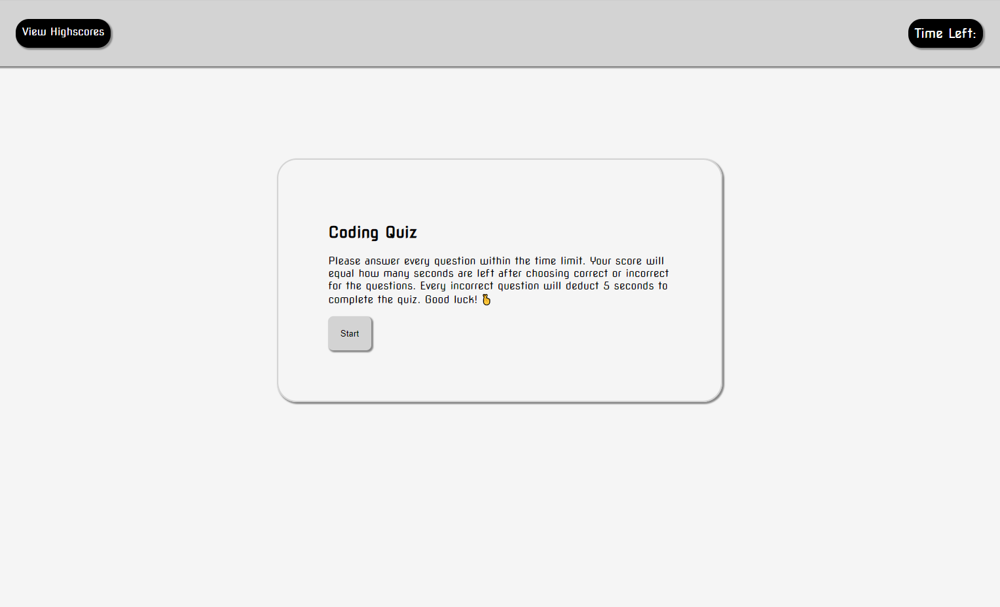

# Timed-Multiple-Choice-Quiz

## Description
Creating a quiz that takes user input and generates their score. First,
creating a start button that will start a countdown timer for the user
to take the quiz. When one question is answered the next appears. If the
user gives an incorrect answer time is taken off the timer. The quiz ends
when the timer hits 0 or the user answers all the questions first. At the
end, entering your initials to show your initials and score of the quiz. Your score and initials will be stored in localstorage.

## Mock-up Image

## Deployed Application URL
https://dmerk2.github.io/Timed-Multiple-Choice-Quiz/